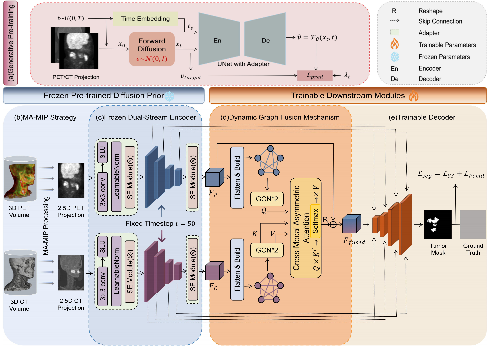

# CDFP-Net : Cross-Modal Dynamic Fusion with Diffusion Priors for PET-CT Tumor Segmentation
CDFP-Net is a novel dual-stream multimodal segmentation framework designed to leverage large-scale generative pre-training priors to enhance the accuracy and robustness of PET-CT tumor segmentation.

## Abstract
Accurate automated tumor segmentation in PET-CT imaging is critical for clinical diagnosis and radiotherapy planning. However, limited annotated data, the high computational cost of volumetric modeling, and intrinsic physical discrepancies between metabolic PET and anatomical CT modalities pose substantial challenges. To address these issues, we propose CDFP-Net, a dual-stream framework that integrates generative diffusion priors with cross-modal dynamic graph fusion. Specifically, we employ a frozen, self-supervised pre-trained Denoising Diffusion Probabilistic Model (DDPM) as a robust feature prior, augmented with lightweight adapters to enhance modality-specific representations under limited supervision. To effectively bridge cross-modal discrepancies, we design a modality-asymmetric dynamic graph fusion mechanism in which metabolically active PET regions act as spatial anchors to query and aggregate complementary anatomical boundary cues from CT. To alleviate the computational burden of full 3D processing while preserving global semantic topology, we further introduce a Multi-Angle Maximum Intensity Projection (MA-MIP) strategy for efficient volumetric context modeling. Extensive experiments on three multi-center datasets (AutoPET, HECKTOR, and PCLT20K) demonstrate that CDFP-Net consistently outperforms state-of-the-art methods in both accuracy and robustness, highlighting its strong potential for precise biological target volume (BTV) delineation in clinical practice.
## Requirement
```pip install -r requirement.txt```
## Preprocessing
The data preprocessing workflow of this project (including multi-angle MIP generation and intensity normalization) is referenced from [MIP-DDPM](https://github.com/Amirhosein2c/MIP-DDPM/tree/main/Data_Preparation).
## Pre-training
```python SS_diff.py```

Note: CT and PET should be pre-trained separately.
## Downstream Fine-Tuning
```python Diff_Seg_early.py```
## Acknowledgment
Code copied a lot from [GenSelfDiff-HIS](https://github.com/suhas-srinath/GenSelfDiff-HIS/tree/main)、[MIP-DDPM](https://github.com/Amirhosein2c/MIP-DDPM/tree/main/Data_Preparation)、[AAHN](https://github.com/joker-527/AAHN)、[HECKTOR2025-MEDAI](https://github.com/Liiiii2101/HECKTOR2025-MEDAI).

